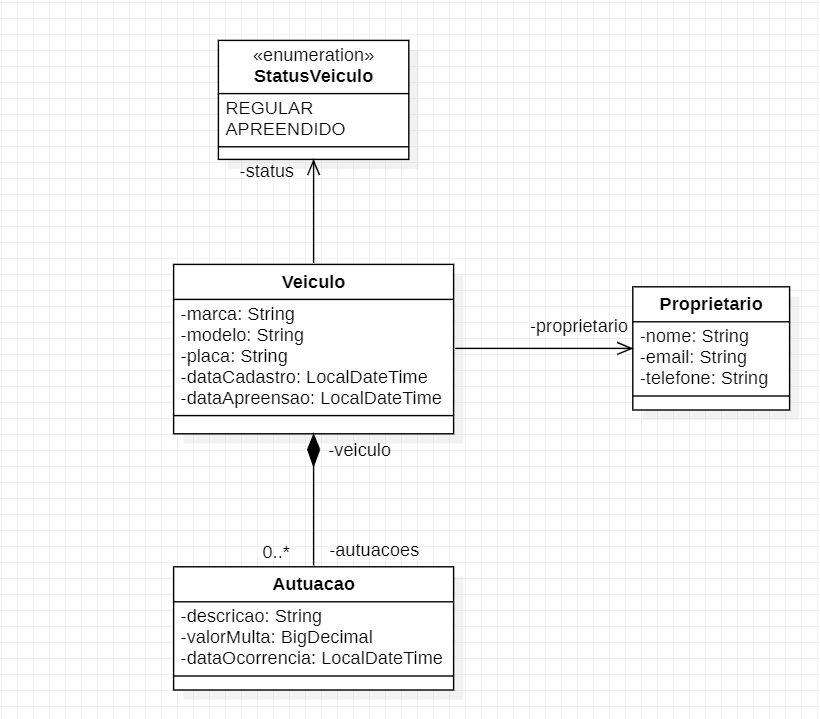

<h1 align="center">Administração de Trânsito</h1>
(READ.me em construção)

## Descrição
Projeto de administração de trânsito consiste em uma API para gerenciar o trânsito de uma cidade ou município.

## Funcionalidades
* **Registro de veículos:** Responsável pelo registro dos veículos.
* **Autuações realizadas pelo agente de trânsito:** Responsável por realizar autuações de veículos e proprietários infratores.
* **Consulta de proprietário do veículo:** Responsável por consultar o proprietário do veículo.
* **Verificar status do veículo:** Responsável por verificar se o veículo encontra-se "Regular" ou "Apreendido".
  
Tudo isso em um modelo de simulação.

## Diagrama Conceitual


## Tecnologias utilizadas
* Java 17
* **Spring 3.1.2:** Spring boot, Spring JPA.
* REST
* MySQL
* Flyway

## Rodando o projeto

- Para rodar o repositório é necessário clonar o mesmo, dar o seguinte comando:
```
mvn clean install
```
- O projeto foi utilizado a IDE do Intellij.

[//]: # (## Implementação futura)

[//]: # (- Modelo de Domínio)


## Colaborador(es)
<table>
  <tr>
    <td align="center">
      <a href="https://github.com/jeffersoncsw">
        <br>
        <sub>
          <b>jeffersoncsw</b>
        </sub>
      </a>
    </td>
  </tr>
</table>

## Status do projeto
Em Andamento